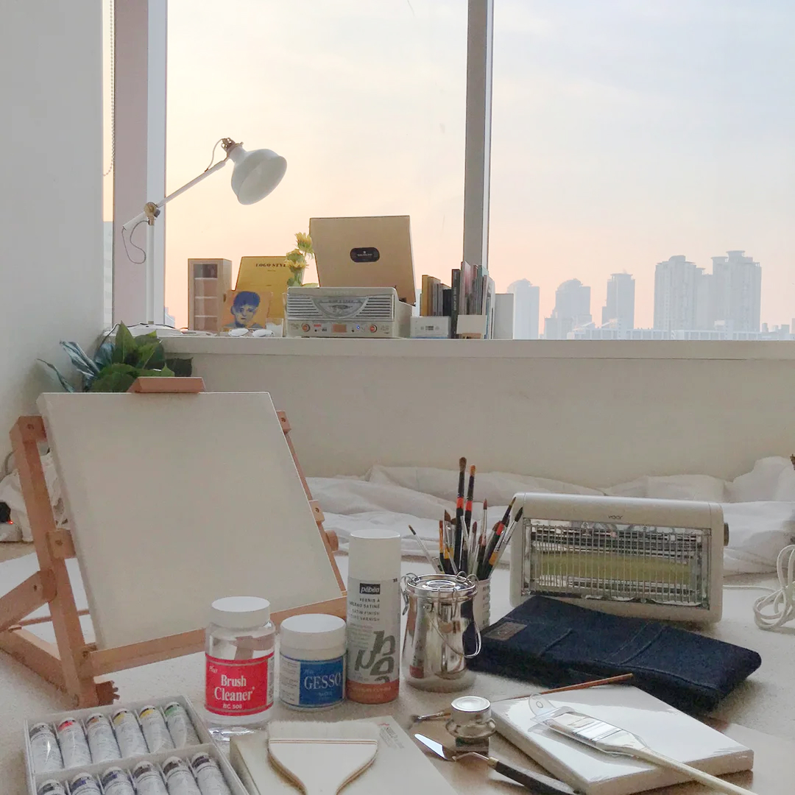

# 내일의 집
프로젝트 기간: 2021/03/21-9월중, 2022/04/03-11 (패스트캠퍼스 프론트엔드 양성 과정을 수강하면서 일정상 프로젝트 기간이 나뉘었습니다.)
배포 주소: https://soft-wisp-4ab2cf.netlify.app/

### 1. GNB

- 로그인을 하지 않은 경우

```html
<div class="gnb-icon-button-group">
  <button
    class="gnb-icon-button is-search lg-hidden"
    type="button"
    aria-label="검색창 열기 버튼"
  >
    <i class="ic-search"></i>
  </button>

  <a
    class="gnb-icon-button is-cart"
    href="/"
    aria-label="장바구니 페이지로 이동"
  >
    <i class="ic-cart"></i>
    <strong class="badge">9</strong>
  </a>

  <div class="gnb-auth sm-hidden">
    <a href="/"> 로그인 </a>
    <a href="/"> 회원가입 </a>
  </div>
</div>
```

- 로그인을 한 경우

```html
<div class="gnb-icon-button-group">
  <button
    class="gnb-icon-button is-search lg-hidden"
    type="button"
    aria-label="검색창 열기 버튼"
  >
    <i class="ic-search"></i>
  </button>

  <a
    class="gnb-icon-button sm-hidden"
    href="/"
    aria-label="스크랩북 페이지로 이동"
  >
    <i class="ic-bookmark"></i>
  </a>

  <a
    class="gnb-icon-button sm-hidden"
    href="/"
    aria-label="내 소식 페이지로 이동"
  >
    <i class="ic-bell"></i>
  </a>

  <a
    class="gnb-icon-button is-cart"
    href="/"
    aria-label="장바구니 페이지로 이동"
  >
    <i class="ic-cart"></i>
    <strong class="badge">9</strong>
  </a>

  <button
    class="gnb-avatar-button sm-hidden"
    type="button"
    aria-label="마이메뉴 열기 버튼"
  >
    <div class="avatar-32">
      
    </div>
  </button>
</div>
```

### 2. Sidebar

- 로그인을 하지 않은 경우

```html
<div class="sidebar-auth">
  <a class="btn-40 btn-outlined" href="">로그인</a>
  <a class="btn-40 btn-primary" href="">회원가입</a>
</div>
```

div class="sidebar-user-menu"로 시작하는 html코드는 사용하지 않습니다. (자세한 사항은 아래 로그인을 한 경우에 코드 첨부)

- 로그인을 한 경우

```html
<div class="sidebar-user">
  <a href="/">
    <div class="avatar-24">
      
    </div>
    <strong class="username">사달라사달라사달라사달라사달라</strong>
  </a>
</div>
```

```html
<div class="sidebar-user-menu">
  <ul class="sidebar-user-menu-list">
    <li class="sidebar-user-menu-item">
      <a href="/"> 마이페이지 </a>
    </li>
    <li class="sidebar-user-menu-item">
      <a href="/"> 나의 쇼핑 </a>
    </li>
    <li class="sidebar-user-menu-item">
      <a href="/"> 스크랩북 </a>
    </li>
    <li class="sidebar-user-menu-item">
      <a href="/"> 알림 </a>
    </li>
    <li class="sidebar-user-menu-item">
      <a href="/"> 이벤트 </a>
    </li>
  </ul>
</div>
```

### 3. Product-review

- 리뷰가 존재하는 경우

```html
<section
  class="product-section product-review"
  id="product-review"
  role="tabpanel"
>
  <header class="product-section-header">
    <h1 class="title">리뷰</h1>
    <strong class="badge" aria-label="566개">566</strong>
    <a class="text-button" href="/">리뷰쓰기</a>
  </header>

  <div class="product-section-content">
    <div class="review-scoreboard">
      <div class="score-summary">
        <strong class="average-score" aria-label="별점 4.8점">4.8</strong>
        <div class="star-rating">
          <i class="ic-star is-active"></i>
          <i class="ic-star is-active"></i>
          <i class="ic-star is-active"></i>
          <i class="ic-star is-active"></i>
          <i class="ic-star is-active"></i>
        </div>
      </div>
      <div class="score-detail">
        <dl class="score-stats-list">
          <div class="score-stats-item is-active">
            <dt>5점</dt>
            <dd>
              <div class="bar-graph">
                <div class="active-bar" aria-hidden></div>
              </div>
              <strong class="count" aria-label="467명">467</strong>
            </dd>
          </div>
          <div class="score-stats-item">
            <dt>4점</dt>
            <dd>
              <div class="bar-graph">
                <div class="active-bar" aria-hidden></div>
              </div>
              <strong class="count" aria-label="87명">87</strong>
            </dd>
          </div>
          <div class="score-stats-item">
            <dt>3점</dt>
            <dd>
              <div class="bar-graph">
                <div class="active-bar" aria-hidden></div>
              </div>
              <strong class="count" aria-label="13명">13</strong>
            </dd>
          </div>
          <div class="score-stats-item">
            <dt>2점</dt>
            <dd>
              <div class="bar-graph">
                <div class="active-bar" aria-hidden></div>
              </div>
              <strong class="count" aria-label="0명">0</strong>
            </dd>
          </div>
          <div class="score-stats-item">
            <dt>1점</dt>
            <dd>
              <div class="bar-graph">
                <div class="active-bar" aria-hidden></div>
              </div>
              <strong class="count" aria-label="0명">0</strong>
            </dd>
          </div>
        </dl>
      </div>
    </div>

    <ol class="review-list">
      <li class="review-item">
        <!-- NOTE: Default -->
        <article class="review-card">
          <h3 class="sr-only">김버그 님이 작성한 리뷰</h3>
          <header class="review-card-header">
            <a class="avatar-24" href="/">
              
            </a>

            <div class="info">
              <a class="user-name" href="/">
                <strong>김버그</strong>
              </a>

              <div class="detail">
                <div class="star-rating-13" aria-label="5.0점 / 5.0점">
                  <i class="ic-star is-active"></i>
                  <i class="ic-star is-active"></i>
                  <i class="ic-star is-active"></i>
                  <i class="ic-star is-active"></i>
                  <i class="ic-star is-active"></i>
                </div>

                <div class="misc">
                  <time datetime="2021-01-01">2021.01.01</time>
                  <span>내일의집 구매</span>
                </div>
              </div>
            </div>
          </header>
          <div class="review-card-body">
            <p>
              오래된 아파트 확장된 방이라 외풍이 너무 심해 급하게 구매했습니다!
              예약배송이라 10일 가까이 기다렸는데 너무너무 만족스러워요~ :) 방이
              큰 편이라 전체가 다 따뜻해지길 바라지도 않았고, 후기를 먼저
              봤던터라 크게 기대를 안햇었는데 기대 이상입니다. 틀어놓으면 확실히
              방 공기가 달라져요! 후끈!!! 까진 아니어도 차가운 공기가
              따뜻해집니다~ 만족스러워요!!! 올 겨울 덕분에 떨지 않고 보낼 수
              있을것 같습니당
            </p>
          </div>
          <footer class="review-card-footer">
            <button type="button" class="btn-outlined btn-32">
              도움이 돼요
            </button>
            <p>
              <strong><span>7</span>명</strong>에게 도움이 되었습니다.
            </p>
          </footer>
        </article>
      </li>
      <li class="review-item">
        <!-- NOTE: 유저 이미지가 없는 경우 -->
        <article class="review-card">
          <h3 class="sr-only">우유파이 님이 작성한 리뷰</h3>
          <header class="review-card-header">
            <a
              class="avatar-24"
              href="/"
              aria-label="우유파이 님의 프로필로 이동"
            >
            </a>

            <div class="info">
              <a class="user-name" href="/">
                <strong>우유파이</strong>
              </a>

              <div class="detail">
                <div class="star-rating-13" aria-label="5.0점 / 5.0점">
                  <i class="ic-star is-active"></i>
                  <i class="ic-star is-active"></i>
                  <i class="ic-star is-active"></i>
                  <i class="ic-star is-active"></i>
                  <i class="ic-star"></i>
                </div>

                <div class="misc">
                  <time datetime="2021-01-01">2021.01.01</time>
                  <span>내일의집 구매</span>
                </div>
              </div>
            </div>
          </header>
          <div class="review-card-body">
            <p>
              작업실에서 손이 시려워서 책상 위에 올려서 쓸걸로 골랐습니다!
              아주아주 뜨듯하고 크기도 적당하고 민트 사고싶엇지만 품절 ㅠㅠ
            </p>
          </div>
          <footer class="review-card-footer">
            <button type="button" class="btn-outlined btn-32">
              도움이 돼요
            </button>
            <p>
              <strong><span>7</span>명</strong>에게 도움이 되었습니다.
            </p>
          </footer>
        </article>
      </li>
      <li class="review-item">
        <!-- NOTE: 리뷰 이미지가 있는 경우 -->
        <article class="review-card">
          <h3 class="sr-only">고영희 님이 작성한 리뷰</h3>
          <header class="review-card-header">
            <a
              class="avatar-24"
              href="/"
              aria-label="고영희 님의 프로필로 이동"
            >
            </a>

            <div class="info">
              <a class="user-name" href="/">
                <strong>고영희</strong>
              </a>

              <div class="detail">
                <div class="star-rating-13" aria-label="5.0점 / 5.0점">
                  <i class="ic-star is-active"></i>
                  <i class="ic-star is-active"></i>
                  <i class="ic-star is-active"></i>
                  <i class="ic-star is-active"></i>
                  <i class="ic-star"></i>
                </div>

                <div class="misc">
                  <time datetime="2021-01-01">2021.01.01</time>
                  <span>내일의집 구매</span>
                </div>
              </div>
            </div>
          </header>
          <div class="review-card-body">
            <div class="review-image">
              
            </div>

            <p>
              고양이가 좋아해요 ㅎㅎ 섬세한 온도조절이 안되는게 아쉽지만, 이
              가격 이 디자인이면 만족할 수 밖에 없어요 :) 좋습니다!
            </p>
          </div>
          <footer class="review-card-footer">
            <button type="button" class="btn-outlined btn-32">
              도움이 돼요
            </button>
            <p>
              <strong><span>7</span>명</strong>에게 도움이 되었습니다.
            </p>
          </footer>
        </article>
      </li>
      <li class="review-item">
        <!-- NOTE: 사용자가 도움됨을 체크, 도움됨 1+ -->
        <article class="review-card">
          <h3 class="sr-only">쿠쿠 님이 작성한 리뷰</h3>
          <header class="review-card-header">
            <a class="avatar-24" href="/">
              
            </a>

            <div class="info">
              <a class="user-name" href="/">
                <strong>쿠쿠</strong>
              </a>

              <div class="detail">
                <div class="star-rating-13" aria-label="5.0점 / 5.0점">
                  <i class="ic-star is-active"></i>
                  <i class="ic-star is-active"></i>
                  <i class="ic-star is-active"></i>
                  <i class="ic-star is-active"></i>
                  <i class="ic-star is-active"></i>
                </div>

                <div class="misc">
                  <time datetime="2021-01-01">2021.01.01</time>
                  <span>내일의집 구매</span>
                </div>
              </div>
            </div>
          </header>
          <div class="review-card-body">
            <p>
              오래된 아파트 확장된 방이라 외풍이 너무 심해 급하게 구매했습니다!
              예약배송이라 10일 가까이 기다렸는데 너무너무 만족스러워요~ :) 방이
              큰 편이라 전체가 다 따뜻해지길 바라지도 않았고, 후기를 먼저
              봤던터라 크게 기대를 안햇었는데 기대 이상입니다. 틀어놓으면 확실히
              방 공기가 달라져요! 후끈!!! 까진 아니어도 차가운 공기가
              따뜻해집니다~ 만족스러워요!!! 올 겨울 덕분에 떨지 않고 보낼 수
              있을것 같습니당
            </p>
          </div>
          <footer class="review-card-footer">
            <button type="button" class="btn-primary btn-32">
              <i class="ic-check"></i>
              도움됨
            </button>
            <p>
              <strong><span>9</span>명</strong>에게 도움이 되었습니다.
            </p>
          </footer>
        </article>
      </li>
      <li class="review-item">
        <!-- NOTE: 사용자가 도움됨을 체크, 도움됨 1+ -->
        <article class="review-card">
          <h3 class="sr-only">랄라 님이 작성한 리뷰</h3>
          <header class="review-card-header">
            <a class="avatar-24" href="/">
              
            </a>

            <div class="info">
              <a class="user-name" href="/">
                <strong>랄라</strong>
              </a>

              <div class="detail">
                <div class="star-rating-13" aria-label="5.0점 / 5.0점">
                  <i class="ic-star is-active"></i>
                  <i class="ic-star is-active"></i>
                  <i class="ic-star is-active"></i>
                  <i class="ic-star is-active"></i>
                  <i class="ic-star is-active"></i>
                </div>

                <div class="misc">
                  <time datetime="2021-01-01">2021.01.01</time>
                  <span>내일의집 구매</span>
                </div>
              </div>
            </div>
          </header>
          <div class="review-card-body">
            <p>가격 대비 만족합니다.</p>
          </div>
          <footer class="review-card-footer">
            <button type="button" class="btn-outlined btn-32">
              도움이 돼요
            </button>
          </footer>
        </article>
      </li>
    </ol>

    <div class="pagination">
      <!-- <button class="page-control page-prev" type="button">
                    <i class="ic-chevron"></i>
                  </button> -->
      <ol class="page-list">
        <li class="page-item is-active">
          <a href="#">1</a>
        </li>
        <li class="page-item">
          <a href="#">2</a>
        </li>
        <li class="page-item">
          <a href="#">3</a>
        </li>
        <li class="page-item">
          <a href="#">4</a>
        </li>
        <li class="page-item">
          <a href="#">5</a>
        </li>
      </ol>
      <button class="page-control page-next" type="button">
        <i class="ic-chevron"></i>
      </button>
    </div>
  </div>
</section>
```

- 리뷰가 존재하지 않는 경우

```html
<section
  class="product-section product-review"
  id="product-review"
  role="tabpanel"
>
  <header class="product-section-header">
    <h1 class="title">리뷰</h1>
    <strong class="badge" aria-label="0개">0</strong>
    <a class="text-button" href="/">리뷰쓰기</a>
  </header>

  <div class="product-section-content">
    <p class="review-empty">
      첫 리뷰를 남겨주세요!<br />
      최대 <strong>500P</strong>를 드립니다.
    </p>
  </div>
</section>
```
